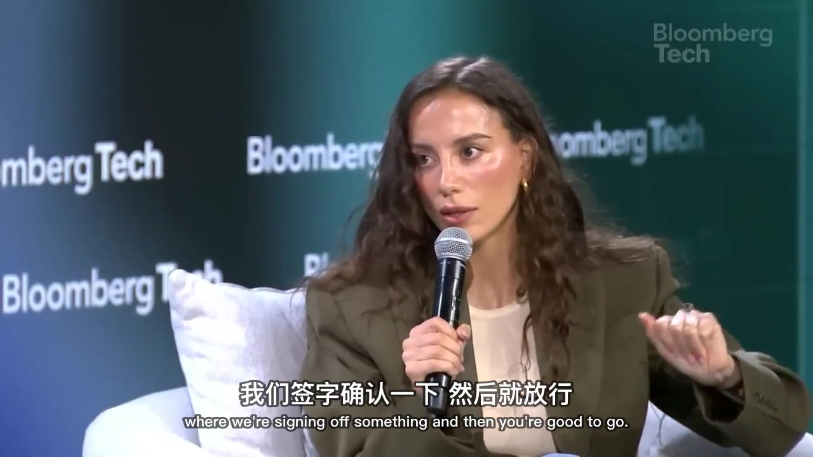

# xiaohu-video-translate

> 一句话把外语视频变成**带中文字幕的视频 + 中文文稿**。下载、转写、翻译、润色、烧录，一条龙跑完，全程本地，转写不花一分钱 API 费。
> One sentence turns a foreign-language video into a **Chinese-subtitled video + a clean transcript**. Download → transcribe → translate → polish → burn-in, end to end, all local, zero transcription API cost.

**语言 / Language:** [中文](#中文) ｜ [English](#english)

这是一套 AI 编程命令行工具用的**技能（Skills）**。它本质是「脚本 + 一份说明书」，**不绑死任何一家**：[Claude Code](https://claude.com/claude-code)、OpenClaw（小龙虾）、Gemini CLI、Codex 都能用。装好后你不用记任何命令，直接说一句「把这个链接翻译成中文字幕视频」，剩下的它全自动做完。

---

## 中文

### 一条龙工作流

它把原本要开四五个软件、来回折腾一两个小时的活，串成一条全自动流水线：

```
视频链接/本地文件
      │
      ▼
  ① 下载  ──►  ② 提取音频 + Whisper 转写  ──►  ③ 翻译  ──►  ④ 润色  ──►  ⑤ 烧录字幕
      │                  （词级时间戳）          （任意外语→中文）  （断句/去标点/对轴）      │
      │                                                                                ▼
      └──────────────────────────────────────────────►  带中文字幕的视频 + Markdown 文稿
```

你只管说一句话，五步它自己走完。中间任何一步要调整（双语、不要水印、快速模式），对它说就行。

### 支持多语种

不挑语言。**英语、日语、韩语、法语、西班牙语……只要 Whisper 听得懂的，都能转成中文字幕。** Whisper 自动识别原语种，翻译环节把任意外语翻成中文。中文视频则只做转写和文稿，不走翻译。

### 字幕两种选

- **纯中文**：画面干净
- **中英双语**：中文大、英文小，主次分明（用真正的 ASS 字幕做字号反差，SRT 做不到这个），适合顺便练听力

### 为什么用它

- **本地、免费、能离线**：转写用 [Whisper](https://github.com/openai/whisper)（苹果芯片走 MLX + Metal GPU 加速），在你电脑里完成，不上传、不收费。翻译复用你已经在用的 AI，不用再单独买翻译 API。
- **时间戳是真的准**：拿词级时间戳按「句子 + 停顿」切分，字幕不会跑在说话人前面，也不会半句甩到下一条。
- **字幕是给人看的**，不是机翻直出：自动纠正转写听错的专有名词（Claude 常被听成 cloud、MCP 被听成 NCP），按语义断句，术语保留英文。
- **烧字幕 + 水印一次编码完成**，不掉画质。

### 它其实是三个技能

| 技能 | 职责 |
|------|------|
| **xiaohu-video-md** | 总指挥。下载 / 提音频 / Whisper 转写 / 调用润色 / 烧字幕 / 出 Markdown |
| **xiaohu-subtitle-polish** | 字幕翻译与润色。纠错、翻译、断句、去标点、时间戳对齐、双语 ASS |
| **xiaohu-video-download** | 纯下载工具。下视频 / 下音频 / 下播放列表 / 给本地视频烧字幕 |

翻译管线由 `xiaohu-video-md` 总调度，翻译那一步它自己会去叫 `xiaohu-subtitle-polish`。三个技能各自独立，也可单独用。

### 演示案例

同一段 a16z 英文访谈，翻成中 / 日 / 韩 / 阿 / 法 5 种语言的双语字幕——各语种译文在上、英文原文在下，从右往左书写的阿拉伯语也排得整整齐齐：


烧进画面后的中英双语字幕（中文大、英文小，贴底不挡人）：



### 支持哪些 AI 编程工具

核心是脚本 + 说明书（每个技能的 `SKILL.md`），**任何能读技能/指令文件、又能跑命令的 AI 编程工具都能驱动它**。各家加载方式不同：

- **Claude Code**：原生技能。`install.sh` 直接把三个技能装进 `~/.claude/skills/`
- **OpenClaw（小龙虾）**：同样是技能制，按它的 `openclaw skills` 方式装入即可
- **Gemini CLI**：仓库自带 `gemini-extension.json`，作为 extension 加载
- **Codex 等其他**：把对应技能的 `SKILL.md` 喂给它当规则，让它照着调用 `scripts/` 里的脚本；或者直接手动跑脚本

下面的安装步骤以 Claude Code 为例，其他工具把"复制到 `~/.claude/skills/`"换成各自的技能目录即可。

### 安装

#### 一、macOS（最顺，尤其是 Apple Silicon）

```bash
# 1. 基础工具（没装 Homebrew 先去 brew.sh 装）
brew install yt-dlp ffmpeg

# 2. 转写引擎（Apple Silicon 选 mlx-whisper，走 GPU 加速最快）
pip3 install --break-system-packages mlx-whisper
# 非 Apple Silicon 的 Mac 用兜底引擎：
# pip3 install --break-system-packages faster-whisper

# 3. 装技能
git clone https://github.com/xiaohuailabs/xiaohu-video-translate.git
cd xiaohu-video-translate
bash install.sh
```

然后在 `~/.claude/skills/xiaohu-video-md/config.json` 把 `output_dir` 改成你的绝对路径。MLX 模型首次运行会自动从 HuggingFace 下载（约 1.5GB），**不用手动下载**。

> `whisper-cpp` 是个**可选的备份转写引擎**，默认走 mlx-whisper / faster-whisper 就不用装它。只有想用 whisper-cli（纯转文字最快）时才 `brew install whisper-cpp`，并把 ggml 模型下到 `~/.cache/whisper-cpp/`（命令见各技能的 `初始化.md`）。

#### 二、Windows

这套工具是按 Mac 调的，Windows 上能跑，但有**三处真实区别**，别照搬 Mac 步骤。

**最省事：用 WSL（Windows 里的 Linux 子系统）。** 装好 WSL2 + Ubuntu 后，基本等同 Linux：

```bash
sudo apt update && sudo apt install -y ffmpeg
pip3 install yt-dlp faster-whisper        # Windows 没有 Apple GPU，用 faster-whisper
git clone https://github.com/xiaohuailabs/xiaohu-video-translate.git
cd xiaohu-video-translate && bash install.sh
```

**原生 Windows（不用 WSL）要注意三点：**

1. **转写引擎用 faster-whisper**，不要装 mlx-whisper（MLX 只支持苹果芯片）。脚本检测到没有 MLX 会自动降级到 faster-whisper：
   ```powershell
   pip install yt-dlp faster-whisper
   winget install Gyan.FFmpeg        # 或用 scoop / choco 装 ffmpeg
   ```
2. **`install.sh` 是 bash 脚本**，原生 Windows 用 Git Bash 跑，或者手动把 `skills/` 下三个文件夹复制到你的工具技能目录，再把每个 `config.example.json` 复制成 `config.json`。
3. **烧字幕的中文字体要换**：脚本里默认用 Mac 的苹方（PingFang SC）。Windows 上没有这个字体，中文会显示成方块。把烧录命令里的 `FontName=PingFang SC` 换成 `FontName=Microsoft YaHei`（微软雅黑，Windows 自带），水印字体路径换成 Windows 字体（如 `C:/Windows/Fonts/msyh.ttc`）。

> 字体这一条对 Linux 也一样：Linux 没有苹方，需要装并改用 Noto Sans CJK 之类的中文字体。

#### 三、Linux

跟 Windows 的 WSL 步骤一致：`apt install ffmpeg` + `pip install yt-dlp faster-whisper`，烧字幕时把字体换成系统自带的中文字体（如 Noto Sans CJK）。

> 想让烧字幕在 Windows / Linux 上**自动选对字体、开箱即用**？欢迎提 issue，这块正在做跨平台适配。

### 怎么用

装好后**重启你的 AI 编程工具**，然后用大白话说：

| 你说的话 | 它做的事 |
|---------|---------|
| `把这个链接翻译成中文字幕视频 https://youtu.be/xxxx` | 全流程：下载→转写→翻译→烧字幕→出文稿 |
| `翻译这个日语视频，要中英双语字幕 https://...` | 同上，多语种源，双语字幕 |
| `把这个视频转成文字 https://...` | 只出 Markdown 文稿，不烧字幕 |
| `给我本地这个视频加中文字幕 ~/Movies/talk.mp4` | 本地文件直接处理 |
| `下载这个视频 https://...` | 只下载视频 + 外挂字幕 |
| `用快速模式转写 https://...` | 换更快但略低精度的模型 |
| `翻译时不要水印` | 关掉水印 |

抖音视频第一次用要先登录一次：运行一次 `python3 ~/.claude/skills/xiaohu-video-md/scripts/douyin_login.py`，弹出的浏览器里扫码登录，登录态只存在你本机。

### 常见问题

- **YouTube 下载报 403 / SABR / PO Token？** 脚本会自动从浏览器读 cookies 重试（默认 Chrome）。还不行就挂代理：给脚本加 `--proxy http://127.0.0.1:7890`。
- **烧出来的中文字幕是方块？** 多半是字体问题：macOS 用苹方，Windows 改微软雅黑，Linux 改 Noto Sans CJK（见上方安装说明）。
- **字幕跑在说话人前面 / 半句挤一起？** 本工具用词级时间戳按句子和停顿切，正常不会；个别片段不对多半是 BGM 太响导致 Whisper 误判，可要求重转。
- **抖音报未登录？** 重跑一次 `douyin_login.py`。

### License

[MIT](./LICENSE)。字幕样式、水印默认值随意改。注意：**不要把你自己的 `config.json` 或抖音登录态提交到任何公开仓库**（`.gitignore` 已默认排除）。

---

## English

A set of **Skills** for AI coding CLIs that turn any foreign-language video into a Chinese-subtitled video plus a clean transcript — download, transcribe, translate, polish, and burn-in, end to end. It's just scripts + a skill instruction file, **not locked to any single tool**: [Claude Code](https://claude.com/claude-code), OpenClaw, Gemini CLI, Codex all work.

### End-to-end pipeline

```
video URL / local file
        │
        ▼
  ① download → ② audio + Whisper transcribe → ③ translate → ④ polish → ⑤ burn-in subtitles
                   (word-level timestamps)    (any language→中文)  (line-break/align)      │
        │                                                                                  ▼
        └────────────────────────────────────────►  Chinese-subtitled video + Markdown transcript
```

### Multi-language

Not English-only. **English, Japanese, Korean, French, Spanish… anything Whisper can hear gets translated into Chinese.** Whisper auto-detects the source language; the polishing step translates any of them into Chinese.

### Why

- **Local, free, offline-capable.** Transcription runs on [Whisper](https://github.com/openai/whisper) (MLX + Metal GPU on Apple Silicon); translation reuses the AI you already have. No paid transcription/translation API.
- **Accurate timestamps** — word-level, cut by sentence + pause, so subtitles don't run ahead of the speaker.
- **Human-grade subtitles** — fixes ASR mishears, breaks lines by meaning, keeps technical terms in English. Bilingual mode uses real ASS for a true size contrast (Chinese large, English small).
- **Burn-in + watermark in one encode.**

### The three skills

| Skill | Role |
|-------|------|
| **xiaohu-video-md** | Orchestrator: download / audio / Whisper / call the polisher / burn-in / Markdown |
| **xiaohu-subtitle-polish** | Subtitle translation & polishing: fixes, translation, line-breaking, timestamp alignment, bilingual ASS |
| **xiaohu-video-download** | Pure downloader: video / audio / playlists / burn subs onto a local file |

### Demo

One a16z English talk, subtitled into 5 languages — Chinese / Japanese / Korean / Arabic / French — each translation on top, the English original below. Even right-to-left Arabic lines up cleanly:


Burned into the frame (Chinese large, English small, pinned to the bottom):


### Which AI coding tools

The core is scripts + a `SKILL.md` per skill — **any agent that can read a skill/instruction file and run shell commands can drive it.** Loading differs per tool:

- **Claude Code** — native skills; `install.sh` drops them into `~/.claude/skills/`
- **OpenClaw** — also skill-based; install via its `openclaw skills`
- **Gemini CLI** — a `gemini-extension.json` is included
- **Codex & others** — feed the `SKILL.md` as instructions and let it call the `scripts/`, or run the scripts directly

### Install

**macOS (best, especially Apple Silicon):**

```bash
brew install yt-dlp ffmpeg
pip3 install --break-system-packages mlx-whisper   # or faster-whisper on non-Apple-Silicon
git clone https://github.com/xiaohuailabs/xiaohu-video-translate.git
cd xiaohu-video-translate && bash install.sh
```

**Windows** — this project is tuned for Mac. Easiest path is **WSL2 + Ubuntu**, then it behaves like Linux. For native Windows, three differences:

1. Use **faster-whisper**, not mlx-whisper (MLX is Apple-Silicon-only; the script auto-falls-back): `pip install yt-dlp faster-whisper` + `winget install Gyan.FFmpeg`
2. `install.sh` is bash — run it under Git Bash, or manually copy the three `skills/` folders into your tool's skill directory and copy each `config.example.json` to `config.json`
3. Swap the burn-in font: change `FontName=PingFang SC` to `FontName=Microsoft YaHei`, and the watermark font path to a Windows font (e.g. `C:/Windows/Fonts/msyh.ttc`)

**Linux** — same as WSL: `apt install ffmpeg` + `pip install yt-dlp faster-whisper`, and use a CJK font (e.g. Noto Sans CJK) for burn-in.

Then set `output_dir` (absolute path) in `~/.claude/skills/xiaohu-video-md/config.json`. The MLX model auto-downloads on first run — no manual download needed.

> `whisper-cpp` is an **optional fallback engine**; the default mlx-whisper / faster-whisper path doesn't need it. Only `brew install whisper-cpp` (and download the ggml models to `~/.cache/whisper-cpp/`) if you specifically want whisper-cli for fastest text-only transcription.

### Usage

Restart your AI tool, then just say:

- *"Translate this link into a Chinese-subtitled video: https://youtu.be/xxxx"*
- *"Translate this Japanese video with bilingual subtitles: https://..."*
- *"Just transcribe this to text: https://..."*
- *"Add Chinese subtitles to my local file ~/Movies/talk.mp4"*

### License

[MIT](./LICENSE). Don't commit your own `config.json` or any Douyin login state to a public repo (already excluded by `.gitignore`).
